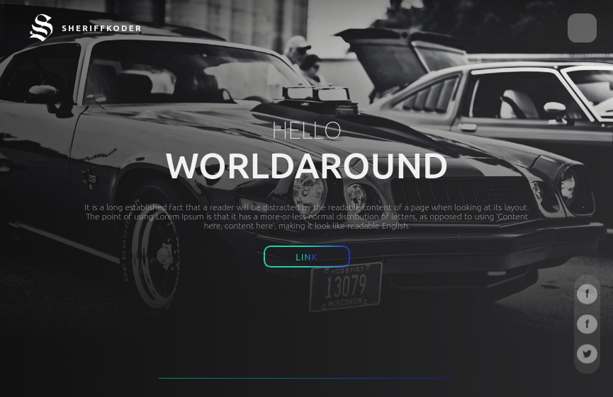

# Side project: Hero Component 
with gradient buttons, borders, CSS 3D Cards & text

>**Main Features**
- Gradient animating navigation buttons
- Gradient animating rounded button border
- Sticky transparent to background social media links with multiple styles depending on the screen width
- 3D cards representation with a mirror effect and animating background color
- 3D cards switch to 2D cards that expand with an animating background color on smaller screen widths and use some 3D text

>**Purpose**
- Practice gradients and CSS perspective

>**How to use**
- Latest progress at ./Parts/Container1/index.html
- [View the page](https://htmlpreview.github.io/?https://github.com/SheriffKoder/Side-Project--Gradients-3D-Cards/blob/main/Parts/Container1/index.html) and hover over the web page's elements to see the effects.